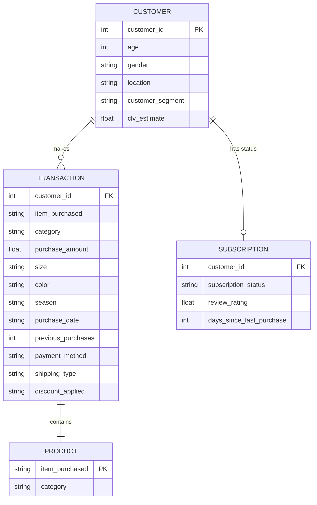

# CustomerPulse — Customer Analytics Dashboard

A full-stack customer intelligence platform built with **Next.js 15**, **FastAPI**, and **SQLite**. Transforms raw retail transaction data into an interactive business intelligence dashboard with RFM segmentation, sales forecasting, correlation analysis, and outlier detection.

---

## 🖥️ Live Pages

| Page | Route | Description |
|---|---|---|
| Landing Page | `/` | Project overview, tech stack, and pipeline diagram |
| Overview Dashboard | `/dashboard` | KPI cards, revenue trends, category & payment charts |
| Customer Segments | `/customers` | RFM cohorts, churn risk alerts, top spenders table |
| Advanced Analytics | `/advanced-analytics` | Sales forecast, Pearson correlation matrix, IQR outlier detection |

---

## 📌 Features

### 1. Overview Dashboard
- **KPI Cards** — Total Revenue, Total Sales Orders, Average Order Value (AOV), Customer LTV Estimate
- **Filter Panel** — Slice data by Product Category, Gender, US State, Payment Channel, Age Range, and Purchase Date range
- **Monthly Sales Trend** — Line chart tracking revenue and order counts over the full transaction timeline
- **Payment Distribution** — Donut chart showing purchase share by payment method (Cash, Card, PayPal, etc.)
- **Category Performance** — Bar chart ranking product categories by total revenue
- **Gender Demographics** — Bar chart comparing revenue contribution by gender

### 2. Customer Segments
- **RFM Cohort Cards** — Customers scored and grouped into lifecycle segments: Champions, Loyal, At Risk, Lost, New, and more
- **Churn Risk Panel** — Subscribers flagged as at-risk based on recency and subscription status
- **Top Spenders Table** — Sortable ledger of top customers by purchase count, average rating, and calculated CLV

### 3. Advanced Analytics
- **6-Month Sales Forecast** — Linear Regression model trained on historical monthly aggregates to project future revenue
- **Pearson Correlation Matrix** — Heatmap showing coefficient strength between numeric customer attributes (age, purchase amount, previous purchases, etc.)
- **IQR Outlier Detection** — Statistical boundary analysis flagging abnormal transaction values using the Interquartile Range method

---

## 🏗️ Architecture

```
Customer Database (SQLite)
        │
        ▼
FastAPI Backend (main.py)
        │
   ┌────┴────┐
   │         │
preprocessor.py   validator.py
(clean & engineer)  (schema checks)
        │
   ┌────┴────┐
   │         │
segmenter.py   forecaster.py
(RFM scoring)  (Linear Regression)
        │
        ▼
REST API Endpoints (/api/kpis, /api/charts, /api/segments, /api/ml)
        │
        ▼
Next.js 15 Frontend (apiService → React pages)
```

---

## 📊 Database Schema



---

## 🛠️ Tech Stack

| Layer | Technology | Purpose |
|---|---|---|
| **Frontend Framework** | Next.js 15 (App Router), React 19 | SPA routing, server components |
| **Language** | TypeScript | Type-safe frontend development |
| **Styling** | Tailwind CSS | Utility-first component styling |
| **Charts** | Recharts | SVG-based interactive data visualizations |
| **Backend Framework** | FastAPI, Python 3.11+ | Async REST API server |
| **ORM** | SQLAlchemy 2.0 | Database session management and queries |
| **Database** | SQLite (local) / PostgreSQL (production) | Transaction data storage |
| **ML & Data** | Scikit-learn, Pandas, NumPy | Linear Regression, RFM calculations, data processing |
| **Validation** | Pydantic v2, pydantic-settings | Request/response schemas and env config |
| **Deployment** | Docker (backend), Vercel (frontend) | Containerized production deployment |

---

## 📁 Folder Structure

```
Customer-Analytics-Dashboard/
├── backend/
│   ├── api/                    # FastAPI route handlers
│   │   ├── charts.py           # Sales trends, category, payment, demographics
│   │   ├── forecast.py         # Sales forecast, outlier detection, correlation
│   │   ├── kpis.py             # Revenue, orders, AOV, CLV aggregations
│   │   └── segments.py         # RFM cohorts, churn risk, top customers
│   ├── config/
│   │   └── settings.py         # Environment variables and path configuration
│   ├── database/
│   │   ├── connection.py       # SQLAlchemy session dependency
│   │   └── models.py           # ORM table definitions (Customer, Transaction, etc.)
│   ├── ml/
│   │   ├── forecaster.py       # Linear Regression sales forecasting model
│   │   └── segmenter.py        # RFM scoring and cohort assignment logic
│   ├── utils/
│   │   ├── preprocessor.py     # Data cleaning, date simulation, feature engineering
│   │   └── validator.py        # Column presence and value range validation
│   ├── exploratory_analysis.py # IQR outlier detection and Pearson matrix helpers
│   ├── main.py                 # FastAPI app entry point, CORS, DB seeding on startup
│   ├── requirements.txt        # Python dependencies
│   └── Dockerfile              # Container image for backend deployment
├── frontend/
│   ├── app/
│   │   ├── (app)/              # Authenticated dashboard routes
│   │   │   ├── dashboard/      # Overview Dashboard page
│   │   │   ├── customers/      # Customer Segments page
│   │   │   ├── advanced-analytics/  # Advanced Analytics page
│   │   │   └── layout.tsx      # Shared sidebar navigation layout
│   │   ├── page.tsx            # Public landing page
│   │   ├── layout.tsx          # Root HTML document layout
│   │   └── globals.css         # Tailwind base imports
│   ├── components/
│   │   ├── MetricCard.tsx      # Reusable KPI metric display card
│   │   └── FilterPanel.tsx     # Global filter panel with dropdowns and date inputs
│   ├── services/
│   │   └── api.ts              # Centralised API client (all backend fetch calls)
│   ├── public/                 # Static images (dashboard screenshots)
│   ├── package.json
│   └── tsconfig.json
├── data/
│   └── raw/
│       └── customer_shopping_behavior.csv   # Source dataset (3,900 records)
├── docs/                       # Project reports and presentations
└── README.md
```

---

## ⚙️ Running Locally

### Prerequisites
- Python 3.11+
- Node.js 18+
- npm

### 1. Start the Backend
```bash
cd backend
pip install -r requirements.txt
python -m uvicorn main:app --port 8000
```
On first boot, the backend automatically reads `data/raw/customer_shopping_behavior.csv`, cleans and engineers the data, then seeds the SQLite database (`backend/customer_pulse.db`).

The API will be available at `http://localhost:8000`.

### 2. Start the Frontend
```bash
cd frontend
npm install
npm run dev
```
Open [http://localhost:3000](http://localhost:3000) in your browser.

### Environment Variables (optional)
Create `frontend/.env.local` to override the default API URL:
```env
NEXT_PUBLIC_API_URL=http://localhost:8000
```

---

## 🚀 Deployment

### Backend — Render + Neon PostgreSQL
1. Create a free PostgreSQL database on [Neon.tech](https://neon.tech/) and copy the connection string.
2. In [Render](https://render.com/), create a new **Web Service** linked to this repository.
3. Set the **Root Directory** to `backend/` and select the **Docker** runtime.
4. Add environment variable:
   - `DATABASE_URL` → your Neon PostgreSQL connection string

### Frontend — Vercel
1. Import this repository in [Vercel](https://vercel.com/).
2. Set the **Root Directory** to `frontend/`.
3. Add environment variable:
   - `NEXT_PUBLIC_API_URL` → your Render backend URL

---

## 📈 Data Pipeline

```
customer_shopping_behavior.csv  (3,900 records, 18 attributes)
        │
        ▼
preprocessor.py
  • Impute missing review ratings (median fill)
  • Simulate purchase_date from previous_purchases count
  • Engineer CLV estimate per customer
        │
        ▼
validator.py
  • Verify required columns are present
  • Check age, purchase_amount, and rating value ranges
        │
        ▼
SQLAlchemy → SQLite (customer_pulse.db)
  • 4 tables: Customer, Transaction, Product, Subscription
        │
        ▼
FastAPI REST Endpoints
  • GET /api/kpis
  • GET /api/charts/sales-trends
  • GET /api/charts/category-performance
  • GET /api/charts/payment-methods
  • GET /api/charts/demographics
  • GET /api/charts/regions
  • GET /api/segments/summary
  • GET /api/segments/top-customers
  • GET /api/segments/churn-risk
  • GET /api/ml/forecast
  • GET /api/ml/correlation
  • GET /api/ml/outliers
```

---

## 💡 Attribution

The raw retail transaction dataset is sourced from the repository [customer-trends-data-analysis-SQL-Python-PowerBI](https://github.com/amlanmohanty1/customer-trends-data-analysis-SQL-Python-PowerBI) by Amlan Mohanty.

All application code — including the Next.js 15 frontend, FastAPI backend, SQLAlchemy ORM layer, RFM segmentation engine, Linear Regression forecasting pipeline, and IQR outlier detection — was built independently as part of this portfolio project.

---

*Made by Suprojeet Sonar · © 2026 CustomerPulse*
