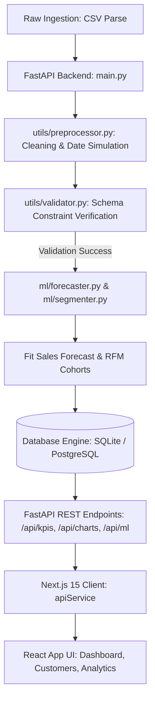
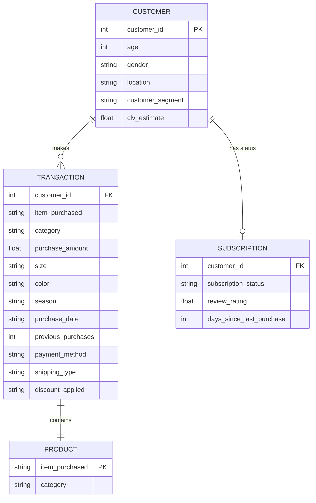

# CustomerPulse: Customer Behavior Analytics & Lifecycle Platform

CustomerPulse is a full-stack customer intelligence and data analytics web application. It transforms transactional retail logs into a clean, interactive business intelligence dashboard featuring predictive sales forecasting, RFM calculations, correlation analysis, outlier detection, and automated data validation.

Developed as a modern final-year portfolio project, the application connects a Python FastAPI backend (using SQLAlchemy ORM) with a responsive Next.js 15 frontend.

---

## 📌 Features

### 1. Interactive Dashboard
* **KPI Cards**: Real-time aggregation of Total Revenue, Orders, Average Order Value (AOV), and Customer Lifetime Value (CLV).
* **Filter Panel**: Slice and filter transaction datasets by Gender, Category, Location, Payment Method, Age range, and date limits.

### 2. Customer Segmentation Page
* **RFM Splits**: Categorizes customers into segments (e.g. Champions, At Risk, Loyal Customers) based on calculated Recency, Frequency, and Monetary scores.
* **Top Spenders Ledger**: Displays top customers sorted by purchase counts, average rating, and calculated CLV values.

### 3. Advanced Analytics Suite
* **6-Month Sales Forecast**: Aggregates historical transaction dates to train and project future monthly sales via statistical Linear Regression.
* **Pearson Correlation Matrix**: Gridded heatmap indicating the coefficient strength between numeric customer attributes.
* **Outlier Detection**: Displays transaction outlier counts and IQR boundaries.

---

## 📸 Dashboard Previews

### 1. Overview Dashboard Page


### 2. Customer Segmentation Analysis


### 3. Sales Forecasting Trends


---

## 🏗️ Architecture Diagram



---

## 📊 Database Schema (ER Diagram)



---

## 🛠️ Tech Stack

| Component | Technology | Description |
|---|---|---|
| **Frontend** | Next.js 15, React 19, TS | Single Page Application framework with Geist fonts |
| **Styling** | Tailwind CSS | Utility-first styling framework |
| **Charts** | Recharts | SVG-based interactive dashboard visual charts |
| **Backend** | FastAPI, Python 3.11 | High-performance asynchronous REST API server |
| **ORM** | SQLAlchemy | Object Relational Mapper for database queries |
| **Database** | SQLite, PostgreSQL / Neon | Local SQLite sandbox & cloud-ready serverless Neon Postgres |
| **Libraries**| Scikit-learn, Pandas, NumPy | Data cleaning, Linear Regression, and metrics |

---

## 📁 Folder Structure

```
customer-trends-data-analysis-SQL-Python-PowerBI/
├── backend/
│   ├── api/                   # REST API Routers
│   │   ├── charts.py          # Coordinates data arrays for dashboard charts
│   │   ├── forecast.py        # Forecasting, outlier limits, and correlation matrix
│   │   ├── kpis.py            # Financial aggregates & filter query logic
│   │   └── segments.py        # RFM categories, churn alerts, and top spenders
│   ├── config/                # Environment configurations
│   │   └── settings.py        # Database URL settings and file path definitions
│   ├── database/              # SQLAlchemy connection wrappers
│   │   ├── connection.py      # Session generator yield dependencies
│   │   └── models.py          # Customer SQLAlchemy DB schema table declarations
│   ├── ml/                    # Data Science algorithms
│   │   ├── forecaster.py      # Statistical linear regression sales forecasting
│   │   └── segmenter.py       # RFM scoring and lifecycle calculations
│   ├── utils/                 # Data cleansing & processing utilities
│   │   ├── preprocessor.py    # Imputation cleaning and date simulations
│   │   └── validator.py       # Columns and range schema validators
│   ├── Dockerfile             # Container configuration file
│   ├── requirements.txt       # Python server packages requirements list
│   ├── exploratory_analysis.py# Helper for IQR outlier math and Pearson matrix
│   └── main.py                # Database seeder on boot, CORS filters, FastAPI entrypoint
├── frontend/
│   ├── app/                   # Next.js 15 app routing directory
│   │   ├── (app)/             # Navigated dashboard paths
│   │   │   ├── advanced-analytics/ # Forecast visualizer and heatmaps page
│   │   │   ├── customers/     # VIP customers ledger page
│   │   │   ├── dashboard/     # KPI visual charts overview page
│   │   │   └── layout.tsx     # Navigation sidebar layout container
│   │   ├── globals.css        # Tailwind CSS root imports
│   │   ├── layout.tsx         # Document viewport setups
│   │   └── page.tsx           # SaaS Landing page UI
│   ├── components/            # Reusable metric blocks and filter panels
│   ├── public/                # Static dashboard screenshot PNG preview files
│   └── services/              # API services
│       └── api.ts             # Central REST query client
├── data/
│   └── raw/                   # Raw transaction CSV dataset folder
└── README.md                  # Project portfolio documentation
```

---

## ⚙️ Running Locally

### 1. Startup Backend Server
```bash
cd backend
pip install -r requirements.txt
python -m uvicorn main:app --port 8000
```
Upon booting, the backend will automatically create and seed the SQLite database file `customer_pulse.db` under the `backend/` folder.

### 2. Startup Frontend Server
```bash
cd frontend
npm install
npm run dev
```
Open [http://localhost:3000](http://localhost:3000) in your browser.

---

## 🚀 Deployment Guide

### Backend Deployment (Render + Neon PostgreSQL)
1. Sign up on [Neon.tech](https://neon.tech/) and create a free serverless PostgreSQL database. Copy the connection string.
2. In Render, create a new **Web Service** and link your repository.
3. Select the **Docker** runtime.
4. Configure Environment Variables:
   * `DATABASE_URL`: Paste your Neon connection string. (SQLite is used if this is omitted).

### Frontend Deployment (Vercel)
1. Create a project in Vercel and link your repository.
2. Select the `frontend` folder as the Root Directory.
3. Configure Environment Variables:
   * `NEXT_PUBLIC_API_URL`: The URL of your backend service on Render.

---

## 💡 Attribution
The raw retail transactional data attributes are inspired by the repository [customer-trends-data-analysis-SQL-Python-PowerBI](https://github.com/amlanmohanty1/customer-trends-data-analysis-SQL-Python-PowerBI) by Amlan Mohanty. 

Significant additions implemented in this platform include the Next.js 15 frontend pages, the FastAPI REST architecture, dynamic filtering and export layers, statistical modeling pipelines (forecasting), and automated validation routines.
